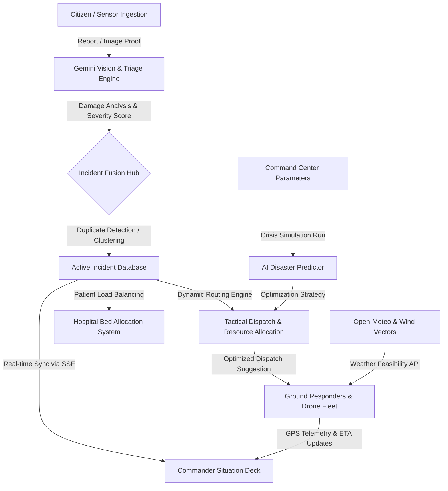

# 🚨 ResQra: AI-Powered Emergency Intelligence & Response Platform

<div align="center">
  
  
  [](https://vite.dev/)
  [](https://react.dev/)
  [](https://tailwindcss.com/)
  [](https://www.typescriptlang.org/)
  [](https://ai.google.dev/)
</div>

---

**ResQra** is a state-of-the-art **Emergency Intelligence & Response Platform** designed to synchronize municipal dispatch centers, ground responders, medical facilities, and citizens during high-stakes disasters and civic crises. Powered by Google's **Gemini AI Engine**, ResQra fuses fragmented inputs, evaluates situational severity, runs disaster simulations, and coordinates tactical dispatch through a unified command dashboard.

---

## 🏛️ System Architecture & Data Flow

ResQra functions as a centralized operations hub. The flowchart below describes how an emergency event progresses from citizen ingestion to active ground response:



---

## 👤 Multi-Role Unified Workspace

ResQra adapts to the exact context of the logged-in emergency stakeholder, providing bespoke operational workflows:

### 1. 🖥️ Emergency Operator & Super Admin Deck
* **Command Telemetry Banner**: Displays real-time critical stats (Average Response Time: `6.8m`, Average Triage Time: `4.2s`, ICU/Burn Bed occupancy rates).
* **Live Incident Feed**: Chronological incident inbox with AI triage tags, confidence scores, civilian casualty counts, and direct trigger actions.
* **Global Command Palette**: Instant navigation via keyboard shortcuts (`Ctrl + K` or `Cmd + K`) allowing operators to execute diagnostic macros, search resources, and dispatch fleets.
* **Interactive D3 Map Overlays**: Visualizes casualty concentration heatmaps, drone wind safety vectors, weather fronts, and live responder trackers.

### 2. 🚑 Ground Responder Tactical Dashboard
* **GPS Telemetry Updates**: Allows field crews (e.g. Captain Rajesh Kumar - NDRF Boat 01) to toggle live tracking, feeding speed, heading, and positioning back to the command center.
* **Ground Status Switches**: Responders can instantly switch states (`DISPATCHED` ➔ `ON_SCENE` ➔ `RESOLVING` ➔ `AVAILABLE`) to update regional routing tables.
* **Action Checklist**: Auto-generated steps based on incident type (e.g., deploy floating lines, secure toxic leak containment) to guarantee protocol compliance under stress.

### 3. 📱 Citizen Reporting Portal
* **Automated Geolocation Lookup**: Ingests citizen reports and runs cellular/Wi-Fi positioning via the **Google Geolocation API** (falling back to municipal coordinates if GPS is restricted).
* **Gemini Vision Damage Triage**: Citizens can upload photos of floods, structural cracks, or fire damage. The AI model analyzes the image in real-time, triaging structural integrity, hazard levels, and returning self-survival tips.
* **Active Responder Track**: A live, priority-routed travel map showing the incoming responder's distance, cardinal traffic descriptions (e.g., "Priority Green Corridor Active"), and real-time ETA.

---

## ✨ Advanced Intelligence Features

### 🧠 Gemini-Powered Incident Triage & Report Fusion
* **Semantic Deduplication**: Parses multiple incoming calls and automatically clusters duplicate reports describing the same physical event within spatial boundaries using the Gemini LLM.
* **Multi-Model Resilience**: Employs a resilient fallback system—trying `gemini-3.7-flash` and falling back to `gemini-2.5-flash` with automatic retry delays to mitigate transient 503/429 API spikes.

### 🗺️ Meteorological & Smoke Plume Dispatching
* **Weather-Aware Drone Limits**: Connects to the **Open-Meteo API** to calculate real-time temperature, wind gusts, relative humidity, and precipitation intensity to determine if aerial drone fleets are cleared for flight.
* **Plume Vector Estimations**: Calculates wind vector dynamics to predict the dispersal direction of hazardous smoke or chemical plumes.

### 🏥 Hospital Bed & Trauma Center Balancing
* **Live Capacity Tracker**: Monitors regional ICU, Burn Unit, and Pediatric bed occupancy rates.
* **Optimal Trauma Routing**: Automatically recommends hospital transfers for casualties based on capacity, specialized departments, and travel proximity.

### 🌀 Predictive Disaster Simulator
* **Scenario Sandbox**: Simulates the propagation curves of wildfires, flash floods, or industrial explosions based on dry fuel levels, wind vectors, and geographical blockages.
* **AI Resource Allocation**: The Gemini engine forecasts resource shortfalls and generates proactive pre-stage directives.

---

## 🛠️ Technology Stack

| Layer | Technologies Used |
| :--- | :--- |
| **Frontend** | React 19 (TypeScript), Vite, TailwindCSS v4, Motion (Framer Motion), Recharts, Leaflet, D3.js |
| **Backend** | Express.js, TypeScript (via `tsx`), Server-Sent Events (SSE) for Real-Time Sync, Node-Fetch |
| **AI Integration** | Google GenAI SDK (`@google/genai` supporting Gemini 3.7 Flash & 2.5 Flash), Gemini Vision |
| **Data & APIs** | In-Memory Relational State Store, Open-Meteo Weather API, Google Geolocation API |

---

## 🚀 Getting Started

### Prerequisites
* **Node.js** (v18 or higher)
* **npm** or **Bun** package manager
* **Google Gemini API Key** (obtain from [Google AI Studio](https://aistudio.google.com/))

### Installation & Run

1. **Install dependencies**:
   ```bash
   npm install
   ```

2. **Configure Environment Variables**:
   Create a `.env` file in the root directory (refer to `.env.example`):
   ```properties
   GEMINI_API_KEY=your_gemini_api_key_here
   GOOGLE_MAPS_API_KEY=optional_google_maps_key
   GOOGLE_GEOLOCATION_API_KEY=optional_geolocation_key
   ```

3. **Start the Development Server**:
   Run the Express server and Vite builder:
   ```bash
   npm run dev
   ```
   Open your browser to `http://localhost:3000` to access the platform.

### Build & Production Deployment

To compile production assets and bundle the server:
```bash
npm run build
npm start
```

---

## 📡 REST API Specifications

The platform exposes several critical API routes for simulation and integration:

* **`GET /api/health`**: Verifies system integrity and displays active database stats.
* **`GET /api/v1/realtime/events`**: Initiates a Server-Sent Events stream for instant updates.
* **`POST /api/v1/incidents`**: Reports a new emergency incident.
* **`POST /api/v1/incidents/:id/analyze`**: Runs Gemini deep analysis on an incident's metadata.
* **`POST /api/v1/incidents/fuse`**: Evaluates report duplication and clusters reports.
* **`POST /api/v1/ai/vision-analyze`**: Analyzes a base64/URL image using Gemini Vision.
* **`POST /api/v1/simulation/run`**: Executes a disaster simulation using parameters and returns optimized resource recommendations.
* **`GET /api/v1/weather/live`**: Fetches current weather and evaluates flight limits.

---

## 🛡️ License

This project is licensed under the MIT License. See [LICENSE](LICENSE) for details.