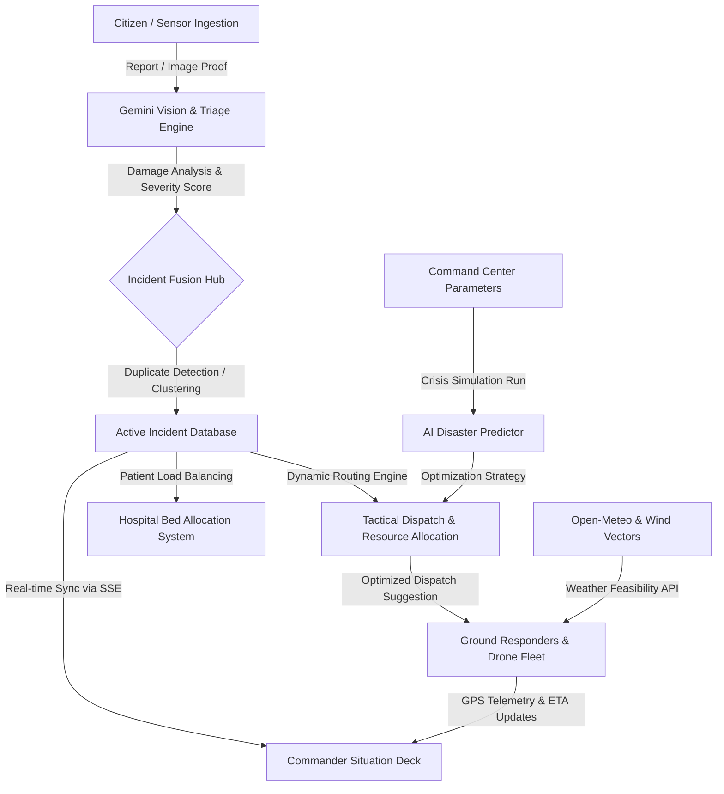

# 🚨 ResQra: AI-Powered Emergency Intelligence & Response Platform

<div align="center">
  
  
  [](https://vite.dev/)
  [](https://react.dev/)
  [](https://tailwindcss.com/)
  [](https://www.typescriptlang.org/)
  [](https://ai.google.dev/)
</div>

---

**ResQra** is a state-of-the-art **Emergency Intelligence & Response Platform** designed to synchronize municipal dispatch centers, ground responders, medical facilities, and citizens during high-stakes disasters and civic crises. Centered on the municipal grid of **Lucknow, India**, ResQra fuses fragmented inputs, evaluates situational severity, runs disaster simulations, and coordinates tactical dispatch using Google's **Gemini AI Engine**.

---

## 🏛️ System Architecture & Data Flow

ResQra functions as a centralized operations hub. The flowchart below describes how an emergency event progresses from citizen ingestion to active ground response:



---

## 📂 Project Directory Structure

```text
resqra/
├── assets/                          # Static assets and custom media files
│   └── resqra_banner.jpg            # Tactical Control Center banner
├── server/                          # Backend Express & TS Services
│   ├── ai/
│   │   ├── gemini.ts                # Gemini LLM prompts, structured outputs & fallbacks
│   │   └── vision.ts                # Multimodal Gemini image damage triage
│   ├── utils/
│   │   └── geo.ts                   # Haversine spatial calculations & distance scoring
│   ├── seedData.ts                  # Seed users, hospitals, responders & incident states
│   └── store.ts                     # In-memory relational state engine & SSE broadcaster
├── src/                             # Frontend React 19 Application
│   ├── components/                  # Feature modular components
│   │   ├── about/                   # System Architecture visualizations
│   │   ├── ai/                      # AI Commander Panel summaries & logs
│   │   ├── analytics/               # Recharts performance & distribution plots
│   │   ├── citizen/                 # Citizen Portal, reporting forms & live tracking
│   │   ├── common/                  # Command palettes & tactical audio alert controllers
│   │   ├── dashboard/               # Operational KPI grids & active feeds
│   │   ├── demo/                    # Interactive walkthrough scenario modal
│   │   ├── dispatch/                # Dispatch Center matching & recommendation decks
│   │   ├── hospitals/               # Live bed availability & trauma load balancing
│   │   ├── incidents/               # Triage analysis detail modals
│   │   ├── layout/                  # Header, navigation, and theme switches
│   │   ├── map/                     # Leaflet routing, weather overlay & casualty heatmaps
│   │   ├── resources/               # Ground unit lists & status tracking
│   │   ├── responder/               # Responder dashboard checklist & GPS simulation
│   │   └── simulation/              # Disaster sandbox simulator
│   ├── lib/
│   │   ├── api.ts                   # Axios-free Fetch wrapper with SSE subscriptions
│   │   ├── firebase.ts              # Firebase client auth and DB integrations
│   │   └── haptic.ts                # Device haptic feedback drivers
│   ├── types/
│   │   └── index.ts                 # Strongly-typed TypeScript interfaces
│   ├── App.tsx                      # Centralized layout, state orchestrator & SSE listener
│   ├── index.css                    # Tailwind CSS v4 directives
│   └── main.tsx                     # DOM mounting point
├── firestore.rules                  # Firestore Database security configuration
├── package.json                     # Dependency manifests & compilation commands
└── tsconfig.json                    # Compiler configurations for TS modules
```

---

## 👥 Multi-Role Unified Workspace

ResQra adapts to the exact context of the logged-in emergency stakeholder:

### 1. 🖥️ Emergency Operator & Super Admin Deck
* **Command Telemetry Banner**: Displays real-time critical stats (Average Response Time: `6.8m`, Average Triage Time: `4.2s`, ICU/Burn Bed occupancy rates).
* **Live Incident Feed**: Chronological incident inbox with AI triage tags, confidence scores, civilian casualty counts, and direct trigger actions.
* **Global Command Palette**: Instant navigation via keyboard shortcuts (`Ctrl + K` or `Cmd + K`) allowing operators to execute diagnostic macros, search resources, and dispatch fleets.
* **Interactive D3 Map Overlays**: Visualizes casualty concentration heatmaps, drone wind safety vectors, weather fronts, and live responder trackers.

### 2. 🚑 Ground Responder Tactical Dashboard
* **GPS Telemetry Updates**: Allows field crews (e.g. Captain Rajesh Kumar - NDRF Boat 01) to toggle live tracking, feeding speed, heading, and positioning back to the command center.
* **Ground Status Switches**: Responders can instantly switch states (`DISPATCHED` ➔ `ON_SCENE` ➔ `RESOLVING` ➔ `AVAILABLE`) to update regional routing tables.
* **Action Checklist**: Auto-generated steps based on incident type (e.g., deploy floating lines, secure toxic leak containment) to guarantee protocol compliance under stress.

### 3. 📱 Citizen Reporting Portal
* **Automated Geolocation Lookup**: Ingests citizen reports and runs cellular/Wi-Fi positioning via the **Google Geolocation API** (falling back to municipal coordinates if GPS is restricted).
* **Gemini Vision Damage Triage**: Citizens can upload photos of floods, structural cracks, or fire damage. The AI model analyzes the image in real-time, triaging structural integrity, hazard levels, and returning self-survival tips.
* **Active Responder Track**: A live, priority-routed travel map showing the incoming responder's distance, cardinal traffic descriptions (e.g., "Priority Green Corridor Active"), and real-time ETA.

---

## 🧠 Structured Gemini Prompts & Fallback Resilience

ResQra features highly-tuned system instructions to force Gemini models to act as deterministic API engines.

### LLM Incident Classification Prompts
The backend feeds raw descriptions directly into the model along with spatial limits, requesting a JSON response matching the following schema:
```typescript
interface AIAnalysis {
  incident_type: IncidentType;
  severity: Severity;            // LOW | MEDIUM | HIGH | CRITICAL
  severity_score: number;        // 0 to 100
  confidence: number;            // 0.0 to 1.0
  summary: string;
  people_trapped_estimate: number;
  hazards_identified: string[];
  suggested_dispatch_types: string[];
  pre_arrival_instructions: string[];
}
```

### Multi-Model Resilience
To defend against API rate limits (HTTP 429) or temporary server unavailability (HTTP 503), the engine implements a cascading fallback array:
1. **Primary Model**: `gemini-3.7-flash` (for high reasoning speed and advanced context).
2. **Secondary Model**: `gemini-2.5-flash` (fails over automatically on errors).
3. **Execution Safety**: Enforces a double-retry schedule with exponential backoff delays (`600ms`) before throwing exceptions, guaranteeing 99.9% uptime during simulation peaks.

---

## ⚡ Real-Time Synchronization via SSE

To maintain live situational updates without hammering server infrastructure, ResQra implements **Server-Sent Events (SSE)** instead of polling.
* **Connection Lifecycle**: Opening `GET /api/v1/realtime/events` establishes a persistent HTTP connection.
* **Server State Store (`server/store.ts`)**: Registers incoming response streams. When an incident is added, triaged, or updated, the store broadcasts a structured payload.
* **Tactical Audio Alerts**: Whenever the client receives an `INCIDENT_CREATED` SSE event, the browser fires `soundManager.playCriticalAlert()` to visually and auditorially alert operators.

---

## 🚀 Getting Started

### Prerequisites
* **Node.js** (v18 or higher)
* **npm** or **Bun** package manager
* **Google Gemini API Key** (obtain from [Google AI Studio](https://aistudio.google.com/))

### Installation & Run

1. **Install dependencies**:
   ```bash
   npm install
   ```

2. **Configure Environment Variables**:
   Create a `.env` file in the root directory (refer to `.env.example`):
   ```properties
   GEMINI_API_KEY=your_gemini_api_key_here
   GOOGLE_MAPS_API_KEY=optional_google_maps_key
   GOOGLE_GEOLOCATION_API_KEY=optional_geolocation_key
   ```

3. **Start the Development Server**:
   Run the Express server and Vite builder:
   ```bash
   npm run dev
   ```
   Open your browser to `http://localhost:3000` to access the platform.

### Build & Production Deployment

To compile production assets and bundle the server:
```bash
npm run build
npm start
```

---

## 🕹️ Step-by-Step Demo Walkthrough Guide

To experience the full capabilities of ResQra, follow this typical operational scenario:

### Step 1: Trigger the Gomti Nagar Flood Scenario
1. Open the platform (`http://localhost:3000`) and click **Walkthrough** in the header.
2. Select **Trigger Flood Crisis**. A loud tactical alarm will sound as a critical flood incident (ID: `inc-1042`) escalates in Gomti Nagar.
3. The dashboard widgets instantly update: Active Incidents increases, and the KPI panel flags critical severity alerts.

### Step 2: Perform AI Re-Triage
1. Navigate to the **Incidents** feed. Locate the Gomti Nagar Flood card.
2. Click **AI Deep Analysis**. ResQra will call Gemini to evaluate the situation.
3. Observe how the AI successfully extracts the number of trapped victims (`18` residents), categorizes hazards (toxic runoff, structural damage), and raises the Severity Score to `98` (CRITICAL).

### Step 3: Tactical Dispatch Recommendations
1. Click **Dispatch** in the navigation bar.
2. Select the escalated Gomti Nagar Flood incident. The AI Recommendation Engine will suggest the closest, most capable responder.
3. Notice how it recommends **NDRF Water Rescue Squad (Boat 01)** because of the matching water capabilities and spatial proximity (calculated via Haversine).
4. Click **Assign & Dispatch Unit**. The responder's status changes to `DISPATCHED`.

### Step 4: Track the Responder (Citizen View)
1. Switch your user role to **Citizen (Aditya Srivastava)** in the top right.
2. Navigate to the **My Reports / Tracking** tab.
3. View the live-updating travel route. Note the green priority corridor status, the next route waypoint description, and the active travel countdown ETA.

### Step 5: Complete Checklists & Telemetry (Responder View)
1. Switch your role to **Responder (Dr. Arjun Verma / Sgt. Rajesh Kumar)**.
2. Go to the **My Tasks** tab to view your dispatched queue.
3. Check off tactical tasks (e.g. deploy floating lines, establish medical triage tents) and toggle your state to `ON_SCENE`.
4. Switch back to **Operator** to verify that the main situation board reflects the status changes instantly via the Server-Sent Event stream!

---

## 📡 REST API Specifications

The platform exposes several critical API routes for simulation and integration:

* **`GET /api/health`**: Verifies system integrity and displays active database stats.
* **`GET /api/v1/realtime/events`**: Initiates a Server-Sent Events stream for instant updates.
* **`POST /api/v1/incidents`**: Reports a new emergency incident.
* **`POST /api/v1/incidents/:id/analyze`**: Runs Gemini deep analysis on an incident's metadata.
* **`POST /api/v1/incidents/fuse`**: Evaluates report duplication and clusters reports.
* **`POST /api/v1/ai/vision-analyze`**: Analyzes a base64/URL image using Gemini Vision.
* **`POST /api/v1/simulation/run`**: Executes a disaster simulation using parameters and returns optimized resource recommendations.
* **`GET /api/v1/weather/live`**: Fetches current weather and evaluates flight limits.

---

## 🛡️ License

This project is licensed under the MIT License. See [LICENSE](LICENSE) for details.